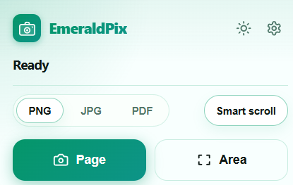
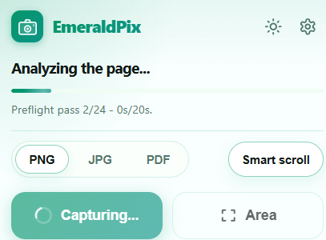

# EmeraldPix

[](LICENSE)

Extension that captures full pages or selected areas and exports to PNG, JPG, or PDF — entirely local, no account, no uploads.




- Scrolls the full page automatically, including lazy-loaded content
- Drag-to-select area capture on the visible viewport
- Dark/Light mode follows system preference
- Keyboard shortcut `Alt + Shift + P`

## Install from source

```bash
npm install
npm run build
```

Open `chrome://extensions` (or `brave://extensions`), enable **Developer mode**, click **Load unpacked** and select the `dist/` folder.

## Development

```bash
npm run dev:ext   # watch build + auto-reload extension
```

A `dev …` badge appears in the popup to confirm the browser loaded the latest build.

## Commands

| Command              | |
| -------------------- | ---------------------------------- |
| `npm run build`      | Type-check + production build      |
| `npm run build:fast` | Skip type-check                    |
| `npm run typecheck`  | TypeScript only                    |
| `npm run lint`       | ESLint                             |
| `npm run format`     | Prettier check                     |

## Architecture

```
src/
  background/   capture orchestration (service worker)
  content/      page measurement, tile scrolling, area selection
  offscreen/    image composition and PDF export
  popup/        UI (Svelte)
  shared/       types, constants, utilities
```

## Permissions

| Permission           | Reason                                        |
| -------------------- | --------------------------------------------- |
| `<all_urls>`         | Capture any webpage                           |
| `downloads`          | Save to Downloads                             |
| `offscreen`          | Compose/encode images off the UI thread       |
| `scripting`          | Inject content script                         |
| `storage`            | Persist settings                              |
| `tabs` / `activeTab` | Read active tab URL and capture state         |

`chrome://`, `edge://` and Chrome Web Store pages cannot be captured.

## Changelog

See [CHANGES.md](CHANGES.md).
