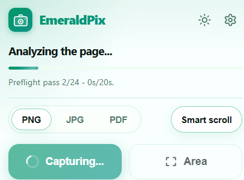
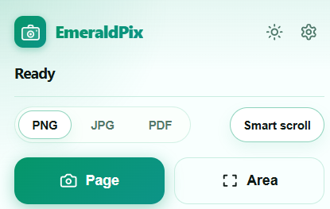

# EmeraldPix

[](LICENSE)

EmeraldPix is a Chromium extension for local page capture. It captures full pages or visible-area selections and exports PNG, JPG, or PDF files without accounts, uploads, or remote processing.




## Highlights

- Full-page capture with automatic scrolling.
- Visible-area capture with drag selection.
- PNG, JPG, and PDF export.
- Smart-scroll preflight for lazy-loaded and growing pages.
- Internal scroll-container capture support.
- Dark, light, and system theme modes.
- Local settings persistence through `chrome.storage` with an IndexedDB mirror.
- Keyboard shortcut: `Alt + Shift + P`.

## Install From Source

Requirements:

- Node.js 22 or newer.
- A Chromium-based browser that supports Manifest V3 and the offscreen document API.

Build the extension:

```bash
npm install
npm run build
```

Load it in the browser:

1. Open the browser extensions page.
2. Enable **Developer mode**.
3. Choose **Load unpacked**.
4. Select the generated `dist/` directory.

Internal browser pages, browser settings pages, and extension marketplace pages cannot be captured because browsers block extension capture on those URLs.

## Development

Run a watch build for extension development:

```bash
npm run dev:ext
```

The popup shows a development build badge when the browser has loaded a watch build.

## Release Build

Create a production build:

```bash
npm run build
```

Package the generated extension:

```bash
cd dist
zip -r ../emeraldpix-v3.5.1.zip .
```

## Commands

| Command                | Description                         |
| ---------------------- | ----------------------------------- |
| `npm run build`        | Type-check and production build     |
| `npm run build:fast`   | Production build without type-check |
| `npm run build:watch`  | Watch build for extension reloads   |
| `npm run dev:ext`      | Alias for the extension watch build |
| `npm run typecheck`    | TypeScript validation               |
| `npm run lint`         | ESLint                              |
| `npm run lint:fix`     | ESLint with automatic fixes         |
| `npm run test`         | Unit tests with Vitest              |
| `npm run test:e2e`     | Playwright extension tests          |
| `npm run test:all`     | Unit and E2E tests                  |
| `npm run format`       | Prettier check                      |
| `npm run format:write` | Prettier write                      |

For local E2E runs without a system Chrome install, use Playwright's bundled Chromium:

```bash
E2E_CHROMIUM_CHANNEL=bundled CI=true npm run test:e2e
```

## Architecture

```text
src/
  background/   Manifest V3 service worker and capture orchestration
  content/      Page measurement, scrolling, area selection, and tile capture
  offscreen/    Image composition, slicing, raster export, and PDF export
  popup/        Svelte popup UI, settings, and status display
  shared/       Message types, constants, persistence, capture math, utilities
```

The capture pipeline is split across three extension contexts:

1. The popup sends capture commands and displays status.
2. The background service worker coordinates tabs, downloads, timeouts, and offscreen work.
3. The content script measures and scrolls the page while the offscreen document composes exported files.

## Permissions

| Permission   | Reason                                 |
| ------------ | -------------------------------------- |
| `<all_urls>` | Capture pages selected by the user     |
| `activeTab`  | Work with the active tab               |
| `alarms`     | Development build reload checks        |
| `downloads`  | Save exported files locally            |
| `offscreen`  | Compose and encode images off the UI   |
| `scripting`  | Inject the capture content script      |
| `storage`    | Persist extension settings             |
| `tabs`       | Resolve active tabs and capture status |

## Privacy

EmeraldPix runs locally in the browser. It does not require an account and does not upload captures to a server. Captured files are saved through the browser downloads API, and settings are stored in browser-managed local storage.

## License

EmeraldPix is licensed under `GPL-3.0-only`. See [LICENSE](LICENSE) for the project notice and the full GPLv3 text.

## Changelog

See [CHANGES.md](CHANGES.md).
